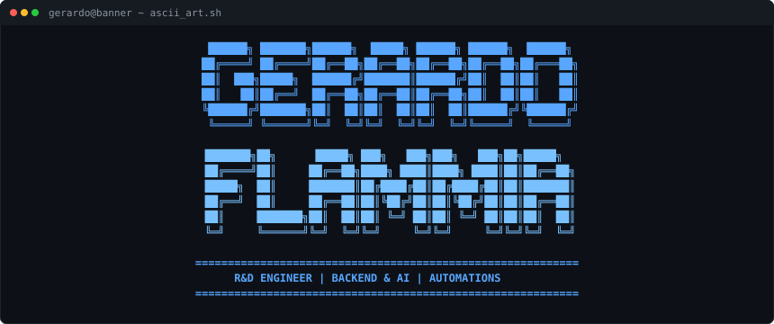

<h3><code>gerardo@github ~ $ ./contributions.sh</code></h3>

  

<h3><code>gerardo@github ~ $ whoami</code></h3>
<table>
  <tr>
    <td valign="top"></td>
    <td valign="top"></td>
  </tr>
</table>

---

### 👨‍💻 About Me

Hello! I'm **Gerardo Rodrigues Flammia**, an **Electronic Engineering in Computing** student at **Universidad Yacambú** (Venezuela) and a passionate **Software & IoT Developer**. 

I build full-stack web applications, automate complex business workflows with **n8n**, integrate Multi-Modal AI models (such as **Google Gemini**), and work with embedded microcontrollers and digital systems.

* 🎓 **Education**: B.S. in Electronic Engineering in Computing (Universidad Yacambú)
* 💼 **Specialization**: Full-Stack Development (PHP / Python / Node.js), Database Design (MySQL), Process Automation (n8n, REST APIs), and AI Vision Integration
* 🏴‍☠️ **Passions**: One Piece, Clean Code, Embedded Systems & Open Source

---

### 🚀 Featured Projects

* 💼 **[Automatizacion de Rendicion de Viaticos (Inter)](https://github.com/gerardorflammia/Automatizacion-de-Rendicion-de-Viaticos-Inter)**
  An automated expense claims system integrating Telegram Bot, n8n workflows, Google Gemini 2.5 Flash OCR vision, PHP, and MySQL for corporate invoice validation and Excel report generation.

---

### 🌐 Connect with Me

* 💼 **LinkedIn**: [gerardo-rodrigues-flammia-1a6522302](https://www.linkedin.com/in/gerardo-rodrigues-flammia-1a6522302)
* 🐙 **GitHub**: [@gerardorflammia](https://github.com/gerardorflammia)

---

  <i>"If you don't take risks, you can't create a future." — Monkey D. Luffy 🏴‍☠️</i>

